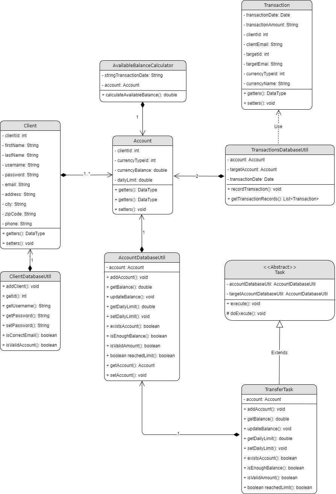

# bank-for-pros

## General info
With this banking web application, users can create accounts, convert currencies, transfer funds, view transaction records in different currencies. They can also view various financial products on the product page.

## Technologies
* Java
* Servlet
* JSP
* JDBC
* HTML & CSS

## Built with 
* Maven
* Tomcat
* JawsDB MySQL

## UML

## Implementation

You can visit the website at https://bank-for-pros.herokuapp.com/ to view the deployed application. 

To run the application locally, you need to have JDK 8, Tomcat 9.0.41 installed on your machine. And you need the servlet, JDBC and JSTL libruaries stated in the POM file put in your Tomcat home. 

To deploy the application to Heroku, you can use IntelliJ's integration with Heroku by running command Heroku:deploy war, or you can deploy the app from Github. 

(It is possible to use other versions, but for me, more recent versions of Tomcat does not work well with Maven, and more recent versions of JDK does not work well on Heroku. )

## Details
Although the app is still small, I am keeping good practices in its development, and trying to exploit the advantages of object-oriented programming:
* No scriptlets: Scriptlets are strictly avoided in JSP pages, and the app takes the form of a small MVC.
* Encapsulation: Account information, such as currency types and client id, is encapsulated when it is passed around, so the application is extensible and can include more types of accounts tomorrow--for instance, debit and credit accounts
* Inheritance: Transaction tasks--and other tasks yet to be implemented--inherit from the abstract task class, following the template design pattern. Thus anyone who creates a new type of task has to implement the record transaction method, yet does not have to duplicate its code.
* Pages are styled so they can be rendered nicely on screens of different sizes
